------

Jump to:

<section class="jump-to">

  <ul>
    <li><a href="#moby">Moby</a></li>
    <li><a href="#tilly">Tilly</a></li>
    <li><a href="#ziggy">Ziggy</a></li>
  </ul>

  <ul>
    <li><a href="#maggie">Maggie</a></li>
    <li><a href="#twinky">Twinky</a></li>
    <li><a href="#bart">Bart</a></li>

  </ul>

  <ul>
    <li><a href="#hannah">Hannah</a></li>
    <li><a href="#photo-gallery">Gallery</a></li>
  </ul>

</section>

<h2 class="larger-heading" id="moby">Moby</h2>
------

  

    Moby is a Border-Aussie (half border collie, half Australian shepherd). I rescued him in 2016, and it's probably the best decision I've ever made. He's too smart for his own good and has unbridled energy. In our first few months, he was constantly getting into trouble. We estimate he's about 7/8 years old at this point, but he shows no signs of slowing down, aside from no longer being obsessed with trashcans. He's the primary reason I choose to continue living in Lexington; with the amount of land we have and seeing how joyous he is being able to frolick as he pleases, I couldn't bear to coop him up in an apartment. 
    Like all dogs, he has his idiosyncrasies - he is constantly rolling around, whether in grass, on a carpet, on a couch, etc. and he gets incredibly jealous when I give Tilly any attention.
  

<figure>
  
  <figcaption>
    The earliest picture I have of Moby
  </figcaption>
</figure>

<h2 class="larger-heading" id="tilly">Tilly</h2>
------

  

    Tilly is my sister's dog. She's a soft-coated wheaten terrier. Like Moby, Tilly has a lot of quirks. Whenever I come home she shows she's excited by wiggling & hopping, but as soon as I approach, she runs away, only resuming the wigglehops at a distance. This continues until she finally bounds up to my feet. She's a bit younger than Moby.
  

<figure>
  
  <figcaption>
    Nobody understands what goes on in Tilly's brain
  </figcaption>
</figure>

<h2 class="larger-heading" id="ziggy">Ziggy</h2>
------

  

    My mother picked up a part time job as a bookkeeper a few years after her 'official' retirement from Accenture. She worked (and still works, but in a greater capacity) for NYC (now NC) based photographer, <a href="https://monicastevenson.com/">Monica Stevenson</a>. I did a bit of summer work for her as well, and got to spend time with her Dachshunds. Ziggy was the first of her dogs I met. He seemed to be in a constant state of joy whenever I saw him. Ziggy would spend a fair bit of time at our house.
  

<figure>
  
  <figcaption>
    Ziggy being mischievous
  </figcaption>
</figure>

<h2 class="larger-heading" id="maggie">Maggie</h2>
------

  

    Monica brought home Maggie towards the end of my time in high school. Like Ziggy, Maggie was at 9 Coleridge pretty often. Also like Ziggy, she was always very affectionate, albeit timid at first. The two of them together would climb all over you if you got on their level. She is heterochromic, leading to a striking (but still cute) visage. 
  

<figure>
  
  <figcaption>
    Maggie as a young puppy
  </figcaption>
</figure>

<h2 class="larger-heading" id="twinky">Twinky</h2>
------

  

    Twinky was our family's first dog. Unfortunately she passed away in 2016. She loved to perch on the backs of couches and also nuzzle her head into pillow crevaces. My dad would get a kick out of getting her to bark. There were words that, without fail, would set her off. One of the ones we heard most frequently was, <em>"deermonk"</em>, a portmanteau of Twinky's two most reviled enemies. Tilly is similar to Twinky in each of those regards, and "deermonk" is still heard today, though Tilly cares less about specific words than abnormal sounds.
  

<figure>
  
  <figcaption>
    Twinky and Tilly look somewhat alike, though Twinky was a little stockier
  </figcaption>
</figure>

<h2 class="larger-heading" id="bart">Bart</h2>
------

  

    Bart lived with us for a couple of years while we were still living in New Jersey. He belonged to our long-time family friend, Dorie, who was staying with us at the time. Bart had severe separation anxiety. The minute Dorie would leave the house, Bart would be inconsolable. Whenever he heard a car pull in the driveway, he would become reinvigorated, but if it turned out <em>not</em> to be Dorie, he would spiral again. He was a gentle giant, and I don't think I ever heard him bark.
  

<figure>
  
  <figcaption>
    Pensive Bart
  </figcaption>
</figure>

<h2 class="larger-heading" id="hannah">Hannah</h2>
------

  

    Hannah was my uncle Scott's dog while he lived in Millburn, NJ. She was a Portugese water dog. I can't recall too many details about her or her quirks. My memories of her include running around uncle Scott's yard/in the stream which bisected it.
  

<figure>
  
  <figcaption>
    Hannah with my Grandma
  </figcaption>
</figure>

<h2 class="larger-heading" id="photo-gallery">Gallery</h2>
------

Moby

<figure>

<figcaption></figcaption>
</figure>

<figure>

<figcaption></figcaption>
</figure>

<!-- SQUARE -->

<!-- <figure>

<figcaption></figcaption>
</figure> -->

<figure>

<figcaption></figcaption>
</figure>

<!-- RECT -->

<!-- <figure>

<figcaption></figcaption>
</figure> -->

<figure>
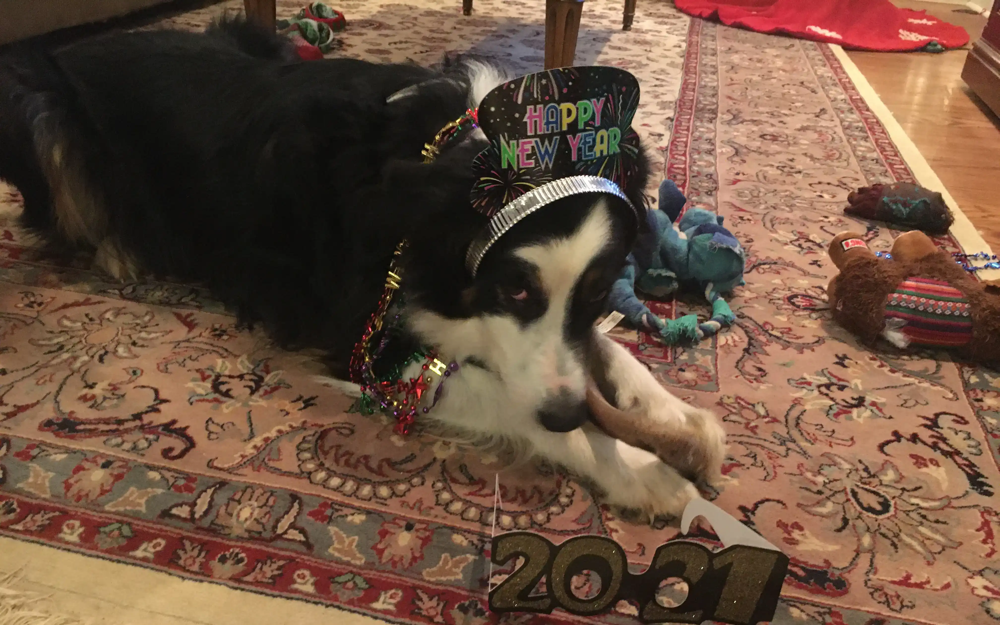
<figcaption></figcaption>
</figure>

<figure>

<figcaption></figcaption>
</figure>

<!-- RECT -->

<!-- <figure>

<figcaption></figcaption>
</figure> -->

<figure>

<figcaption></figcaption>
</figure>

  <figure class="gif">
    
    <figcaption></figcaption>
  </figure>

<figure>

<figcaption></figcaption>
</figure>

<figure>

<figcaption></figcaption>
</figure>

<figure>

<figcaption></figcaption>
</figure>

<!-- RECT -->

<!-- <figure>

<figcaption></figcaption>
</figure> -->

<figure>

<figcaption></figcaption>
</figure>

<figure>

<figcaption></figcaption>
</figure>

<figure>

<figcaption></figcaption>
</figure>

<figure>

<figcaption></figcaption>
</figure>

<figure>

<figcaption></figcaption>
</figure>

<!-- SQUARE -->

<!-- 
<figure>
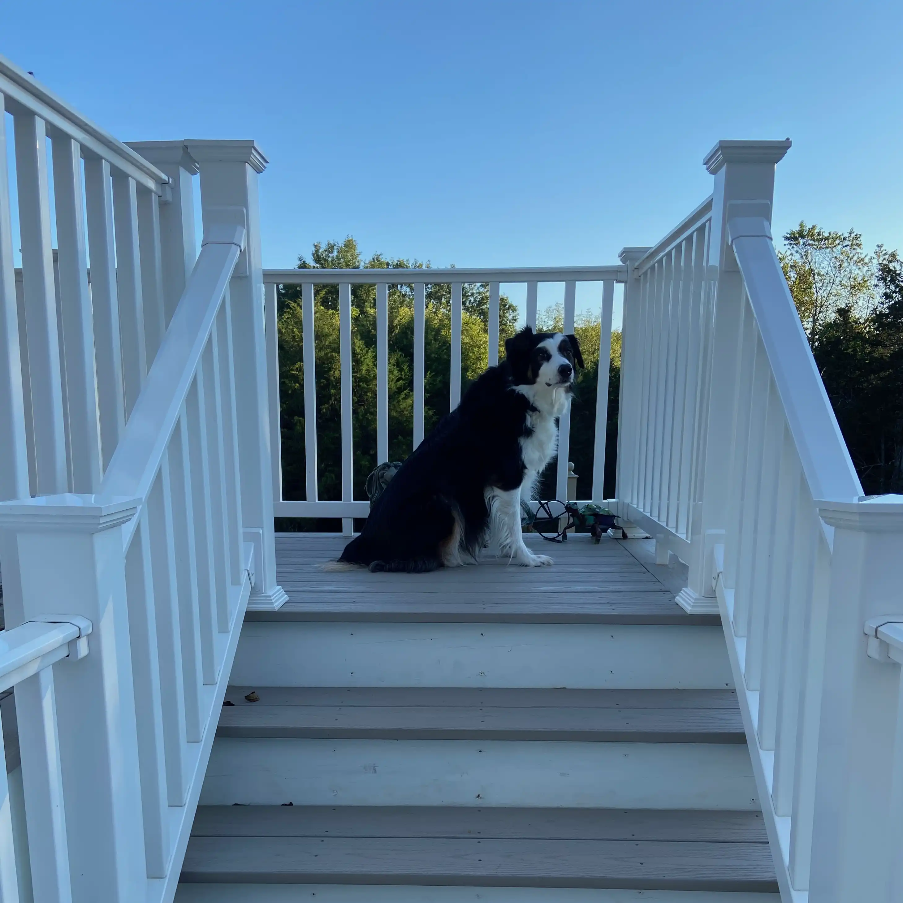
<figcaption></figcaption>
</figure> -->

<figure>

<figcaption></figcaption>
</figure>

  <figure class="gif">
    
    <figcaption></figcaption>
  </figure>

<figure>

<figcaption></figcaption>
</figure>

<figure>

<figcaption></figcaption>
</figure>

<figure>

<figcaption></figcaption>
</figure>

<figure>

<figcaption></figcaption>
</figure>

<!-- SQUARE -->

<!-- <figure>

<figcaption></figcaption>
</figure> -->

<figure>

<figcaption></figcaption>
</figure>

<figure>

<figcaption></figcaption>
</figure>

<figure>

<figcaption></figcaption>
</figure>

<figure>

<figcaption></figcaption>
</figure>

<figure>

<figcaption></figcaption>
</figure>

<!-- HERE!!!! -->

  <figure class="gif">
    
    <figcaption></figcaption>
  </figure>

<!-- RECT -->

<!-- <figure>

<figcaption></figcaption>
</figure> -->

<figure>

<figcaption></figcaption>
</figure>

<figure>

<figcaption></figcaption>
</figure>

<figure>

<figcaption></figcaption>
</figure>

<figure>
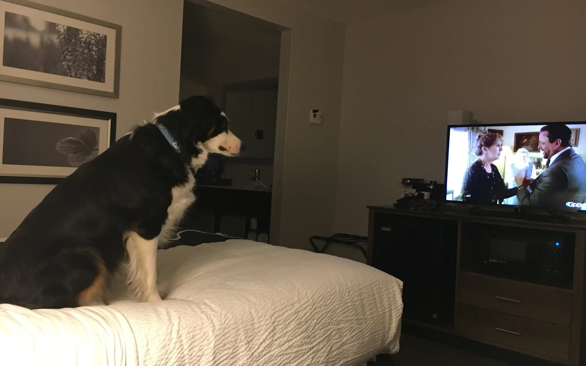
<figcaption></figcaption>
</figure>

<figure>
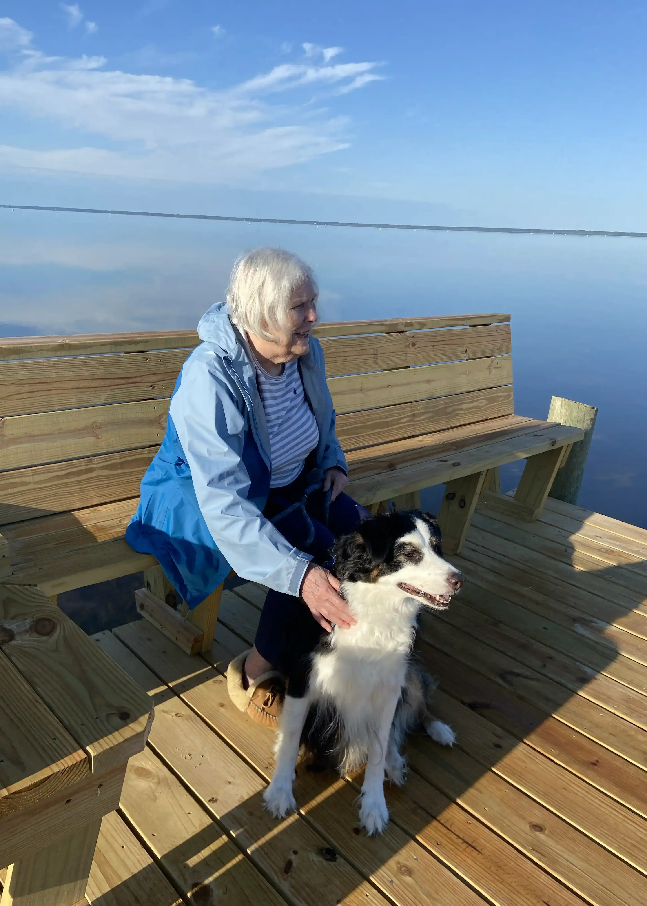
<figcaption></figcaption>
</figure>

<figure>

<figcaption></figcaption>
</figure>

<figure>

<figcaption></figcaption>
</figure>

<figure>

<figcaption></figcaption>
</figure>

<!-- SQUARE -->

<!-- <figure>

<figcaption></figcaption>
</figure> -->

<figure>

<figcaption></figcaption>
</figure>

<figure>

<figcaption></figcaption>
</figure>

<figure>

<figcaption></figcaption>
</figure>

<figure>

<figcaption></figcaption>
</figure>

<figure>

<figcaption></figcaption>
</figure>

<figure>

<figcaption></figcaption>
</figure>

<figure>
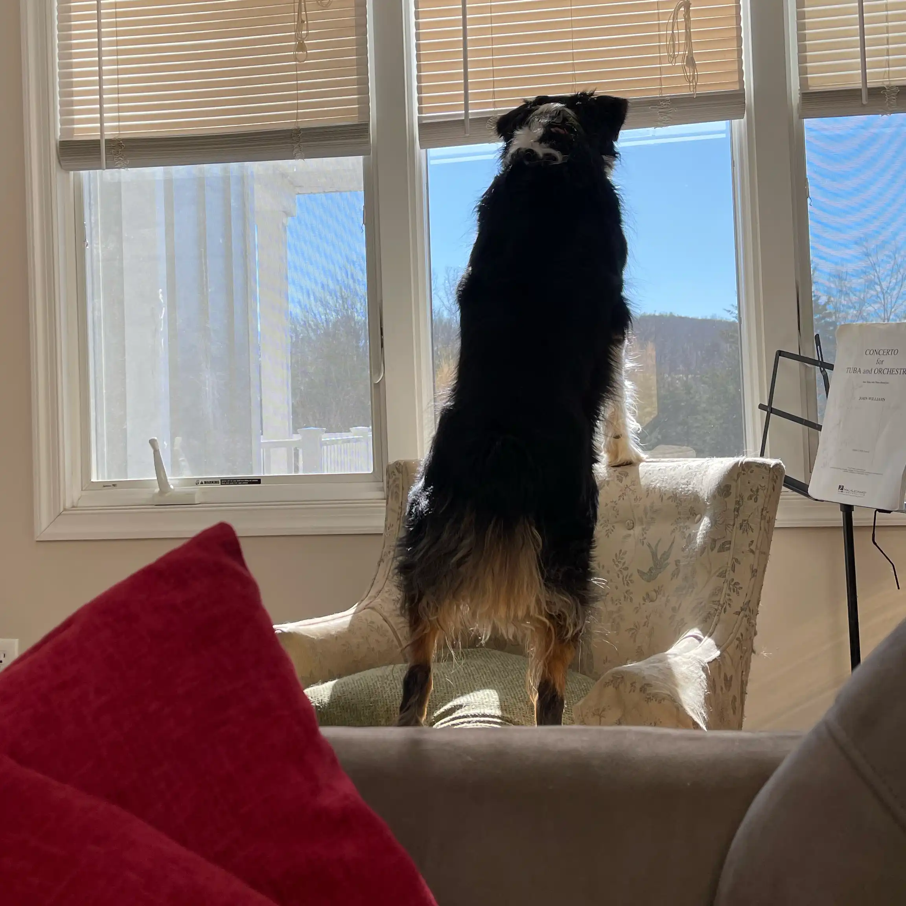
<figcaption></figcaption>
</figure>

<figure>

<figcaption></figcaption>
</figure>

<figure>

<figcaption></figcaption>
</figure>

<figure>

<figcaption></figcaption>
</figure>

<figure>

<figcaption></figcaption>
</figure>

<figure>

<figcaption></figcaption>
</figure>

<figure>

<figcaption></figcaption>
</figure>

<figure>
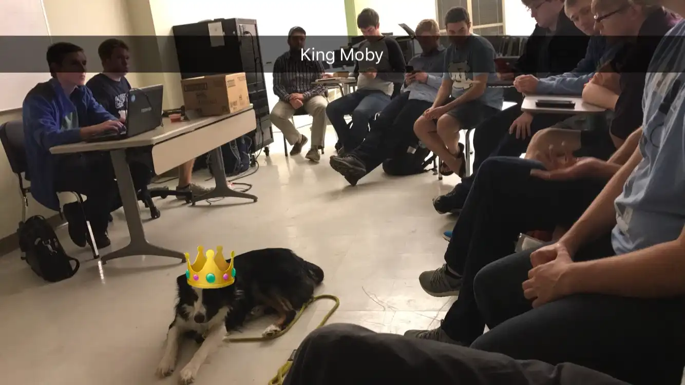
<figcaption></figcaption>
</figure>

<figure>
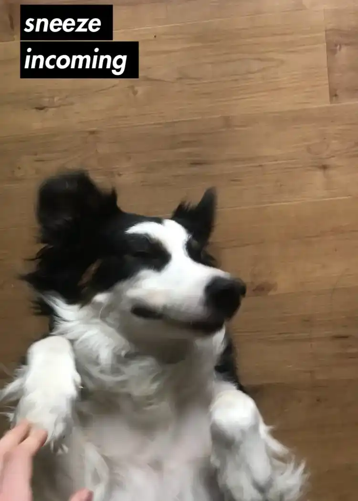
<figcaption></figcaption>
</figure>

<figure>

<figcaption></figcaption>
</figure>

<figure>

<figcaption></figcaption>
</figure>

<figure>

<figcaption></figcaption>
</figure>

<figure>

<figcaption></figcaption>
</figure>

<figure>

<figcaption></figcaption>
</figure>

<figure>
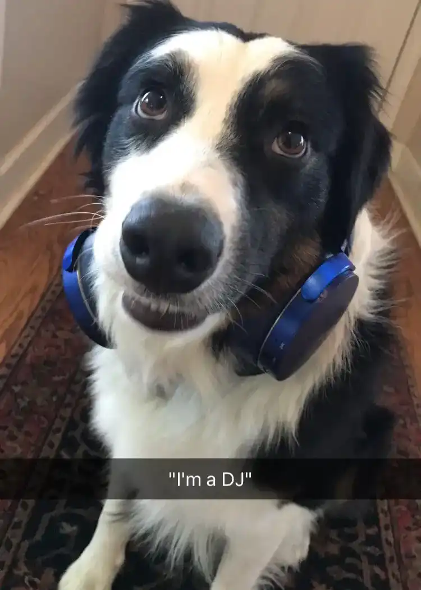
<figcaption></figcaption>
</figure>

<figure>

<figcaption></figcaption>
</figure>

<figure>
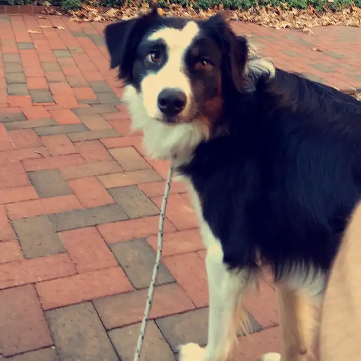
<figcaption></figcaption>
</figure>

<figure>

<figcaption></figcaption>
</figure>

<figure>

<figcaption></figcaption>
</figure>

<figure>
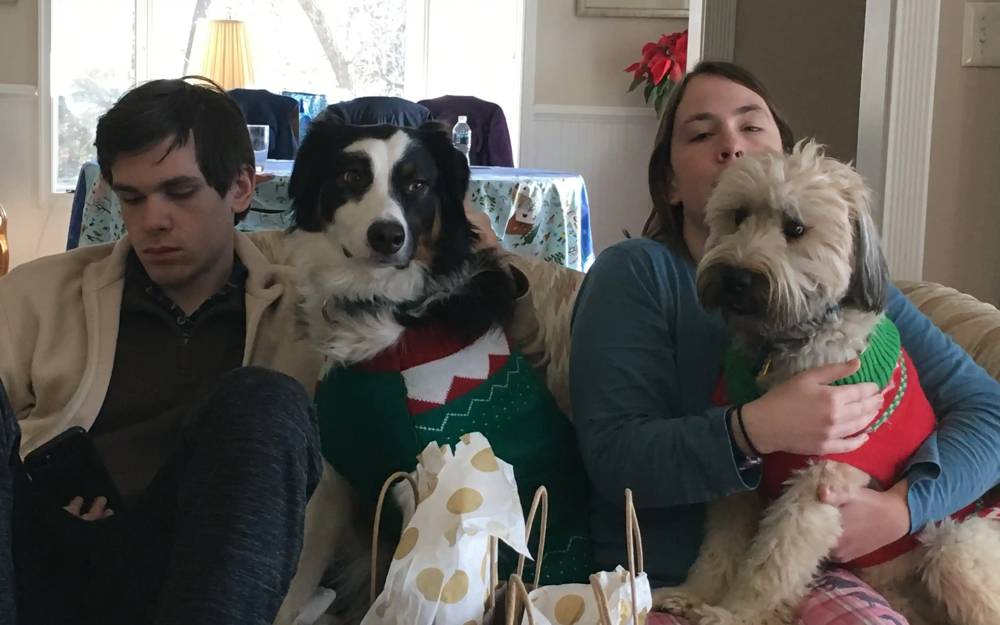
<figcaption></figcaption>
</figure>

<figure>

<figcaption></figcaption>
</figure>

<figure>

<figcaption></figcaption>
</figure>

<figure>

<figcaption></figcaption>
</figure>

<!-- RECT -->

<!-- <figure>

<figcaption></figcaption>
</figure> -->

<figure>

<figcaption></figcaption>
</figure>

<figure>

<figcaption></figcaption>
</figure>

<figure>

<figcaption></figcaption>
</figure>

<figure>

<figcaption></figcaption>
</figure>

<figure>

<figcaption></figcaption>
</figure>

<figure>

<figcaption></figcaption>
</figure>

<figure>

<figcaption></figcaption>
</figure>

<figure>

<figcaption></figcaption>
</figure>

<!-- RECT -->

<!-- <figure>

<figcaption></figcaption>
</figure> -->

<figure>

<figcaption></figcaption>
</figure>

<figure>

<figcaption></figcaption>
</figure>

<figure>

<figcaption></figcaption>
</figure>

<figure>

<figcaption></figcaption>
</figure>

<figure>

<figcaption></figcaption>
</figure>

<figure>

<figcaption></figcaption>
</figure>

<figure>

<figcaption></figcaption>
</figure>

<figure>

<figcaption></figcaption>
</figure>

<figure>

<figcaption></figcaption>
</figure>

<figure>

<figcaption></figcaption>
</figure>

<figure>

<figcaption></figcaption>
</figure>

<figure>

<figcaption></figcaption>
</figure>

<!-- SQUARE -->

<!-- <figure>

<figcaption></figcaption>
</figure> -->

<figure>

<figcaption></figcaption>
</figure>

<figure>

<figcaption></figcaption>
</figure>

<figure>

<figcaption></figcaption>
</figure>

<figure>

<figcaption></figcaption>
</figure>

<figure>

<figcaption></figcaption>
</figure>

<figure>

<figcaption></figcaption>
</figure>

<figure>

<figcaption></figcaption>
</figure>

<figure>

<figcaption></figcaption>
</figure>

<figure>
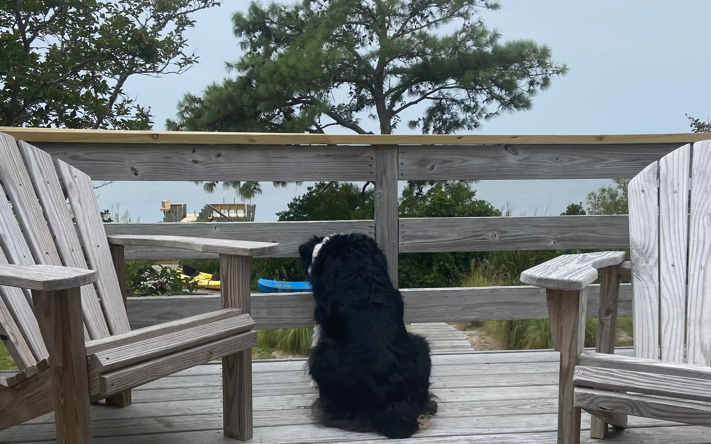
<figcaption></figcaption>
</figure>

<figure>
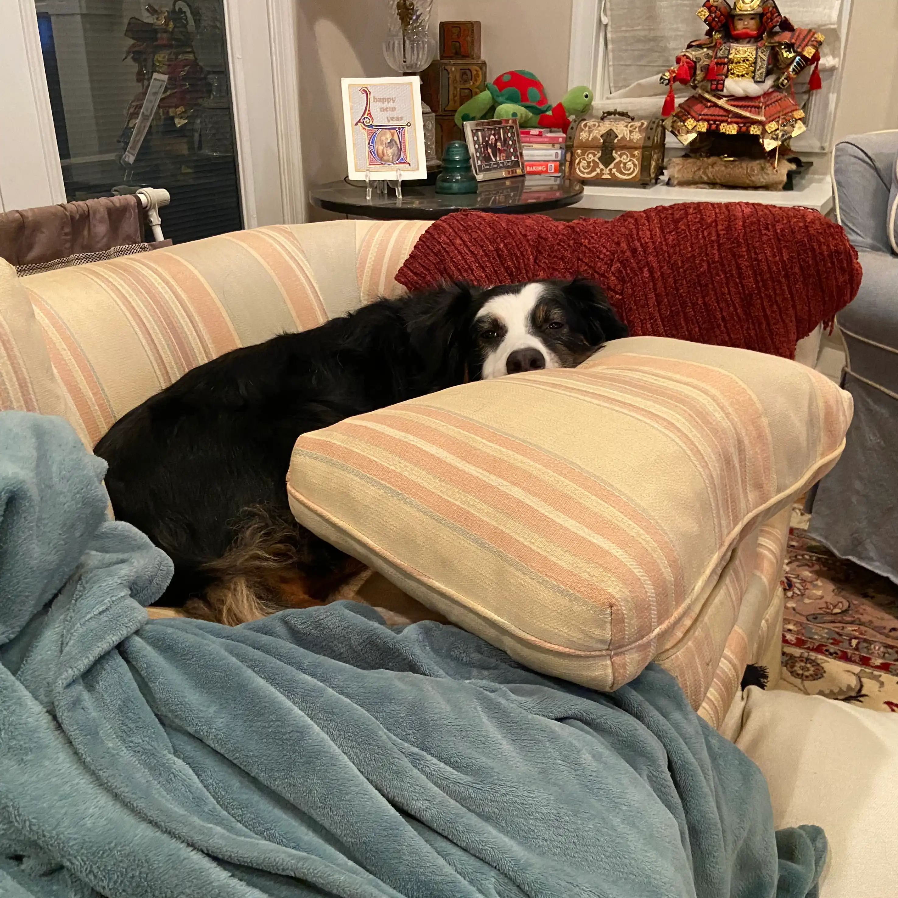
<figcaption></figcaption>
</figure>

<figure>

<figcaption></figcaption>
</figure>

<figure>

<figcaption></figcaption>
</figure>

<figure>

<figcaption></figcaption>
</figure>

<figure>

<figcaption></figcaption>
</figure>

<figure>

<figcaption></figcaption>
</figure>

<figure>

<figcaption></figcaption>
</figure>

<figure>

<figcaption></figcaption>
</figure>

<figure>

<figcaption></figcaption>
</figure>

<figure>

<figcaption></figcaption>
</figure>

<figure>

<figcaption></figcaption>
</figure>

<figure>
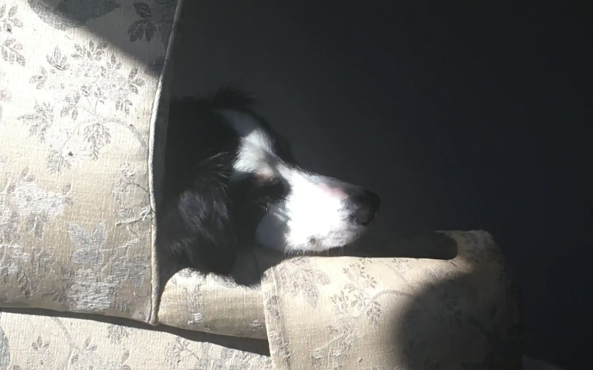
<figcaption></figcaption>
</figure>

<figure>

<figcaption></figcaption>
</figure>

<figure>

<figcaption></figcaption>
</figure>

<figure>

<figcaption></figcaption>
</figure>

<figure>

<figcaption></figcaption>
</figure>

<figure>

<figcaption></figcaption>
</figure>

<figure>

<figcaption></figcaption>
</figure>

<figure>

<figcaption></figcaption>
</figure>

<figure>

<figcaption></figcaption>
</figure>

<figure>

<figcaption></figcaption>
</figure>

<!-- RECT -->

<!-- <figure>

<figcaption></figcaption>
</figure> -->

  <figure class="gif">
    
    <figcaption></figcaption>
  </figure>

Twinky, Bart, and the Dachshunds

<figure>

<figcaption></figcaption>
</figure>

<figure>

<figcaption></figcaption>
</figure>

<figure>

<figcaption></figcaption>
</figure>

<figure>

<figcaption></figcaption>
</figure>

<figure>

<figcaption></figcaption>
</figure>

<figure>

<figcaption></figcaption>
</figure>

<figure>

<figcaption></figcaption>
</figure>

<figure>

<figcaption></figcaption>
</figure>

<figure>

<figcaption></figcaption>
</figure>

<figure>

<figcaption></figcaption>
</figure>

<figure>

<figcaption></figcaption>
</figure>

<figure>

<figcaption></figcaption>
</figure>

<figure>

<figcaption></figcaption>
</figure>

<figure>

<figcaption></figcaption>
</figure>

<figure>

<figcaption></figcaption>
</figure>

<figure>

<figcaption></figcaption>
</figure>

<figure>

<figcaption></figcaption>
</figure>

<figure>

<figcaption></figcaption>
</figure>

<figure>

<figcaption></figcaption>
</figure>

<figure>

<figcaption></figcaption>
</figure>

<figure>

<figcaption></figcaption>
</figure>

<figure>

<figcaption></figcaption>
</figure>

<figure>

<figcaption></figcaption>
</figure>

<figure>

<figcaption></figcaption>
</figure>

<figure>

<figcaption></figcaption>
</figure>

<figure>

<figcaption></figcaption>
</figure>

<figure>

<figcaption></figcaption>
</figure>

Tilly

<figure>

<figcaption></figcaption>
</figure>

<figure>

<figcaption></figcaption>
</figure>

<figure>

<figcaption></figcaption>
</figure>

<figure>

<figcaption></figcaption>
</figure>

<figure>

<figcaption></figcaption>
</figure>

<figure>

<figcaption></figcaption>
</figure>

<figure>

<figcaption></figcaption>
</figure>

<figure>

<figcaption></figcaption>
</figure>

<figure>

<figcaption></figcaption>
</figure>

<figure>

<figcaption></figcaption>
</figure>

<figure>

<figcaption></figcaption>
</figure>

<figure>

<figcaption></figcaption>
</figure>

<figure>

<figcaption></figcaption>
</figure>

<figure>

<figcaption></figcaption>
</figure>

<figure>

<figcaption></figcaption>
</figure>

<figure>

<figcaption></figcaption>
</figure>

<figure>

<figcaption></figcaption>
</figure>

<figure>

<figcaption></figcaption>
</figure>

<figure>

<figcaption></figcaption>
</figure>

<figure>

<figcaption></figcaption>
</figure>

<figure>

<figcaption></figcaption>
</figure>

