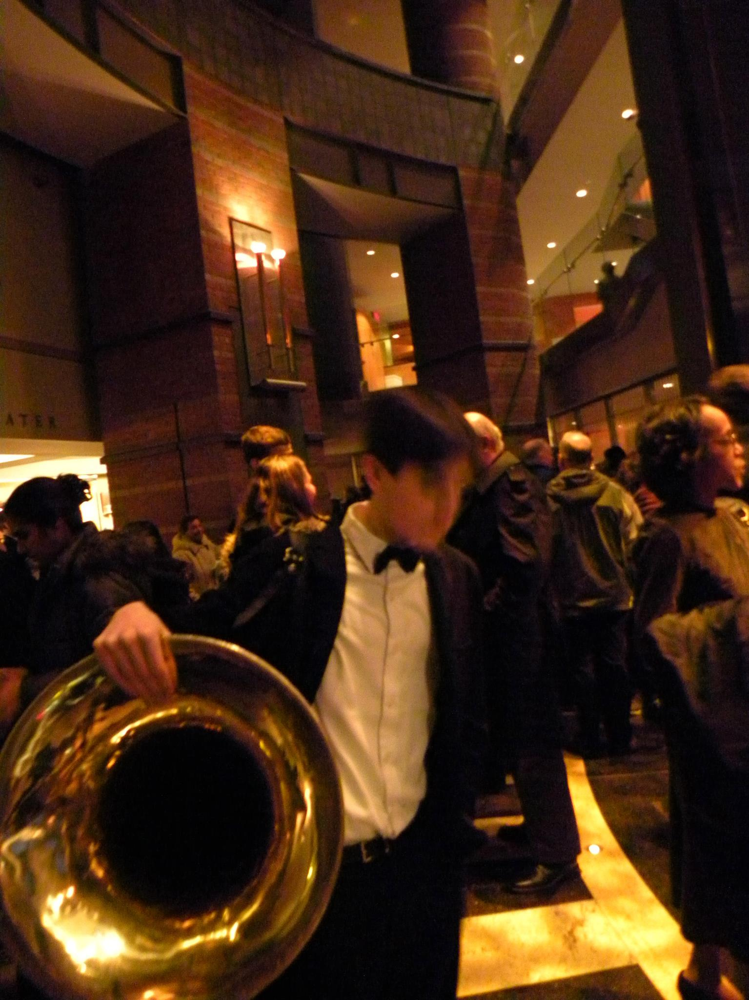

<!-- 
  You can also find my articles on <u><a href="{{author.googlescholar}}">my Google Scholar profile</a>.</u>
 -->




  


------

<h2 id="larger-heading">Bio and Background</h2>

<em>Einleitung</em>
------
As is the case for a large proportion of students across the country, in the fifth grade I was required to play an instrument in the band. I was coerced into playing the trumpet, and I ended up <em>despising</em> band as a result.
It was also the case that the majority of students in the district dropped band once it became optional the following year. I planned to do the same, but by the time I approached the band director to do so she had already lost
such a large number of students that she couldn't afford to lose more, and so she asked if I'd prefer to switch instruments, which I was actually open to, since the reason I didn't enjoy band was simply that I was an awful trumpeter.
She listed off the parts that were absent from the ensemble, but ended with, <em>I think I know the perfect instrument for you</em>. We walked down to the "Brass Cave" in the middle school's basement. It was a room filled from floor to ceiling with shelves holding 
brass instruments, both in cases, and not. She pointed to the corner of the room where a four rotor contrabass B♭ tuba was standing. Dent-ridden and lacquer stripped, it didn't look very pretty. She pulled up a chair, showed me how to pick the horn up safely, then said, <em>play</em>.
I blew a note, felt the instrument, the chair, and my own body resonating with it, and knew that, thanks to this band director, I had found something special.

<em>Eggs & Beens</em>
------

  

    In my first rehearsals I was somewhat disappointed to learn that in a typical middle school band program, the low brass (and tuba(s) particularly)
    don't get to play the 'fun parts' very often. After discussing this with the director, she suggested taking private lessons so I cold explore some
    more interesting repertoire with guidance & feedback. So I began taking private lessons with Joe Eggebeen, whose instruction enabled me to open a new door
    in artistic expression. He must have seen something within the first few lessons as he began urging me to audition for the NJ regional band which held
    auditions every year. The audition piece was Handel's <em>Larghetto and Allegro</em> (arr. Donald C. Little) in addition to scales and sight-reading.
    I had only been playing for about six months by the time the audition rolled around, but somehow I was awarded the first chair.
  

<figure>
  
  <figcaption>
    Myself and Joe Eggebeen following an All State Wind Ensemble concert at NJPAC
  </figcaption>
</figure>

<em>When You're a Jet</em>
------

  

    Had I not won that spot in that particular year, my life trajectory would have been entirely different.
    I remember being awestruck by the first chord we sounded, thinking we collectively sounded like a pipe organ. It was the music specifically though that left an indelible mark, and one piece in particular: a medley of songs from Leonard Bernstein's score to <em>West Side Story</em>. For two or three weeks I begged my mom to buy me a copy of West Side Story on DVD, and when she finally acquiesced I watched the movie every day after school through the rest of the sixth grade.
  

  <figure>
     
    <figcaption>
      Taken during a regionals rehearsal. The photographer told me to pretend to play. Smiling like that while playing is a huge no-no
    </figcaption>`
  </figure>

<em>A Young Person's Guide to the Orchestra</em>
------
Daily practice never seemed to be enough to sate my 'musical appetite'. Moreover acquiring sheet music to noodle on was not the simple process it is today, and especially for the instruments I play.
I learned quickly how to transpose after spending my lawn mowing money on a book of John Williams melodies written for Bb clarinet. Also at the time, if I wanted to explore new music to listen to, 
it meant spending a fortune on an iPod, CD player, on the iTunes store and on CD's, and headphones. I learned of YouTube, which launched a couple of years earlier, late during 7th grade and it was a game-changer.
One of my first searches was, of course, <em>Leonard Bernstein West Side Story</em>. Within minutes I discovered Bernstein's televised [<em>Young People's Concerts</em>](https://leonardbernstein.com/about/educator/young-peoples-concerts) with the New York Philharmonic. While each broadcast was impactful, 
episodes 8, [<em>Who is Gustav Mahler</em>](https://www.youtube.com/watch?v=pk0itgZ14w0), 34, [<em>A Birthday Tribute to Shostakovich</em>](https://www.youtube.com/watch?v=_Wh6OPybR_Q), 46, [<em>Berlioz Takes a Trip</em>](https://www.youtube.com/watch?v=MjVwM1nRK8Y), and 51 [Thus Spake Richard Strauss](https://www.loc.gov/item/lbypc.0541/), were particularly life-changing. My angsty teenage brain felt as if I alone understood the
fundamental struggle of Mahler, the defiance of Shostakovich, the rhapsosidic musings of Berlioz, and the Nietzschean meditations of Strauss. As I grew older I began to understand such feelings were, of course, not unique to myself and these composers,
rather an innate part of the human condition. Bernstein's narration also engendered a novel ability to discuss music and musical ideas both eloquently and academically. Also thanks to Bernstein I began to grasp even
of the versatility of low brass instruments, being able to exude demonic airs, as in Berlioz's Parody of the [Dies Irae](https://www.youtube.com/watch?v=DmOFplgWzyk) plainchant from the Requiem Mass, evoke one man's fretful [march to the guillotine](https://youtu.be/Zl9S5D3BLMA?si=MnxIdBJ0zx9i-QCh&t=2255), the executioner's laughter as the blade falls, and solemn resignation followed by a resurgence of hope lifting you to ["the highest heights on angels' wings, only to be clubbed down once again by fate"](https://www.youtube.com/watch?v=vzbsVlG8ips). 'Doors' such as these would continue to open throughout high school by old clips of Bernstein,
one of the most powerful being his Norton Lecture Series, [<em>The Unanswered Question</em>](https://www.youtube.com/watch?v=8fHi36dvTdE&list=PLKiz0UZowP2V0mwtNv1lc1_zUSB2O65d7).

<em>Pendular Progress</em>
------

  

    I am only speaking for myself, but low brass instruments have a particularly ruthless learning curve,for people like me who not prodigies.
    Initial progress sometimes seems riddled with impassable barriers, but is followed by relatively smooth sailing for a <em>short</em> time before the curve once again spikes.
    These periods of smooth sailing followed by seemingly insurmountable hurdles have repeated for as long as I have been playing. Many such obstacles I have simply not overcome. 
    Throughout high school my practice approach was not very methodical. Thanks to an abundance of time, this caused no issues,
    and so I would continue to successfully audition for groups, but now at a larger scope: first statewide, then nationwide, and so when it came time for college auditions, I was fairly numb
    to the anxieties inherent to this process. I can't remember the total number of schools I either sent tapes to or auditioned at, but it was a lot.
  

  <figure>
    
    <figcaption>
      Myself following an All State Wind Ensemble concert at NJPAC
    </figcaption>
  </figure>

While attending a conservatory was an attractive idea,
they were, generally speaking, not financially viable for me and my family. So most schools I applied had either full music scholarships available or scholarships substantial enough to make the tuition 
affordable. Somehow UNC Chapel Hill got on to my radar due to the William R. Kenan Jr. Music Scholarship. UNC seemed like it would be a good fit both academically and musically, and In 2014, through a stroke of
pure luck, I was awarded the scholarship after auditioning.

Below are the pieces I played for that audition:
<ul>
    <li>Horn Concerto No. 1 (Richard Strauss; transc. John Anderson)</li>
    <li>Concerto for Bass Tuba and Orchestra (R. Vaughan Williams; edited by David Matthews)</li>
    <li><em>C'era una volta il West</em> (Ennio Morricone; solo part transc. Wolffe)</li>
</ul>

<em>The Ghost of Hill Hall</em>
------
UNC was both musically and academically invigorating. My first semester I felt slighltly out of place due to being from New Jersey, but that quickly passed
thanks to the welcoming atmosphere on campus. During my time there, I performed with the UNC Wind Ensemble, UNC Symphony Orchestra, brass quintet, tuba/euph 
quartet, Triangle Brass Band, and others.

My freshman year, the tubists majoring in music at UNC had a 'studio' of sorts in the basement of Hill Hall called Studio 9 (we had various names for it at various times. I most frequently referred to it as <em>Nein</em>). 
That year I was living in Ehringhaus residence hall, which was a hike from any buildings I regularly needed to be in for classes or rehearsals. 
At some point, and the details are muddy, a couch from the apartment of a recent graduate ended up in Studio 9. My then girlfriend went to Stanford in Palo Alto, CA, and we would often FaceTime until 3am or so. Not wanting to cause conflicts with my roommate, I would sleep on that couch, and in the mornings, walk a short distance to the SRC to shower, etc. A benefit to this was I could 
practice at essentially any time I wished without having to walk 15 minutes to and from Ehaus. A side effect was people started referring to me as <em>the ghost of hill hall</em>.

<em>An Idée Fixe & How to be HIP</em>
------

  

    Thanks to Mike's research/presence in the early music sphere, I was able to learn some period instruments and perform on them too. Mike applied to be a mentor at the National Music Festival in 2016, and I auditioned for the tuba spot after learning about it. The music director was interested in having Ophicleides for that summer's performance of Berlioz's <em>Symphonie Fantastique</em>, and I thought it would be fun/a challenge to learn the instrument. We borrowed a B♭ ophicleide (which was constructed in the mid 19th century) from Duke's museum/collection of early instruments. The horn was falling apart however, and so I had to MacGyver it together with hair ties. You could essentially play any pitch with any key combination, and so preventing the intonation from being atrocious was a struggle. Mike played the second "tuba" part on a Serpent in B♭.
  

  <figure>
  
  <figcaption>After the final concert of NMF 2016. Left to right: Emily Farmer, Katie Rose Hand, Mike Kris, and myself</figcaption>
  </figure>

<em>Tubby</em>
------

  

    Most of the repertoire we performed at NMF was on modern horns, and you can see my contrabass CC tuba in the photo above. Other highlights of NMF were Prokofiev's 7th symphony, and my first time being featured as the soloist in a performance of <a href="https://www.loc.gov/static/programs/national-recording-preservation-board/documents/TubbyTheTuba.pdf"><em>Tubby the Tuba</em></a>. Journalist and NPR radio personality Liane Hansen was the narrator for <em>Tubby</em>. Despite the humour of the name, <em>Tubby</em> is sort of a rite of passage among tubists. 
  

  <figure>
    
    <figcaption>
      Myself with Liane Hansen, former host of NPR's award winning <em>Weekend Edition Sunday</em> after our performance of <em>Tubby</em>
    </figcaption>
  </figure>

<em>Sacked</em>
------

  

    The next fall I started learning the Bass-Sackbut so I could participate in UNC's Sackbut ensemble. We did a few gigs in Durham that fall, notably a performance of Tomás Luis de Victoria's Requiem with the Duke Vespers at Duke Chapel.
  

  
<figure>
  
  <figcaption>
    The Fall 2016 UNC Sackbut Ensemble at Duke chapel. From left to right: myself with bass sackbut, Ben Albano & Katie Rose Hand with tenor sackbuts, and Mike Kris with alto sackbut
  </figcaption>
</figure>

