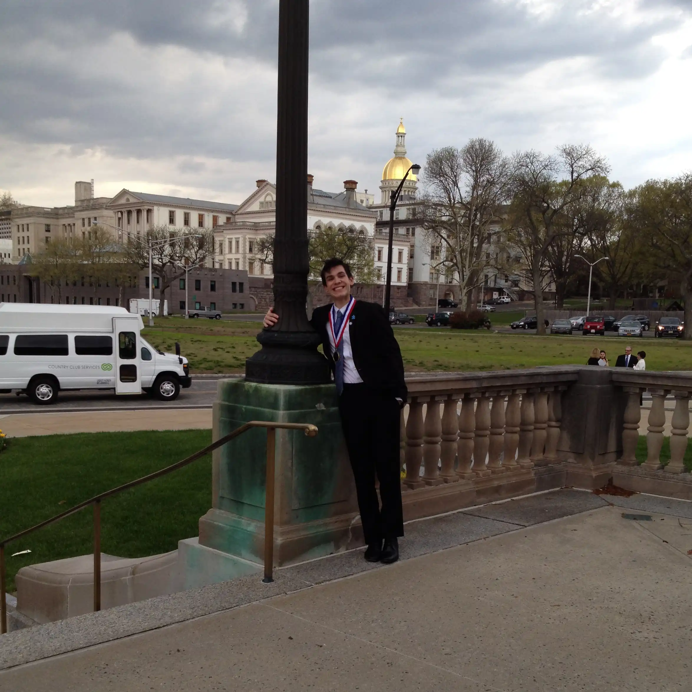

<!-- 
  You can also find my articles on <u><a class="cust" href="{{author.googlescholar}}">my Google Scholar profile</a>.</u>
 -->




  


------

<section class="jump-to">
  
Jump to:

  <ul>
    <li><a class="cust" href="#Bio">Bio and Background</a></li>
    <li><a class="cust" href="#photo-gallery">Gallery</a></li>
  </ul>
</section>

<h2 class="larger-heading" id="Bio">Bio and Background</h2>

<em>Einleitung</em>
------
As is the case for a large proportion of students across the country, in the fifth grade I was required to play an instrument in the band. I was coerced into playing the trumpet, and I ended up <em>despising</em> band as a result.
It was also the case that the majority of students in the district dropped band once it became optional the following year. I planned to do the same, but by the time I approached the band director to do so she had already lost
such a large number of students that she couldn't afford to lose more, and so she asked if I'd prefer to switch instruments, which I was actually open to, since the reason I didn't enjoy band was simply that I was an awful trumpeter.
She listed off the parts that were absent from the ensemble, but ended with, <em>I think I know the perfect instrument for you</em>. We walked down to the "Brass Cave" in the middle school's basement. It was a room filled from floor to ceiling with shelves holding 
brass instruments, both in cases, and not. She pointed to the corner of the room where a four rotor contrabass B♭ tuba was standing. Dent-ridden and lacquer stripped, it didn't look very pretty. She pulled up a chair, showed me how to pick the horn up safely, then said, <em>play</em>.
I blew a note, felt the instrument, the chair, and my own body resonating with it, and knew that, thanks to this band director, I had found something special.

<em>Eggs & Beens</em>
------

  

    In my first rehearsals I was somewhat disappointed to learn that in a typical middle school band program, the low brass (and tuba(s) particularly)
    don't get to play the 'fun parts' very often. After discussing this with the director, she suggested taking private lessons so I cold explore some
    more interesting repertoire with guidance & feedback. So I began taking private lessons with Joe Eggebeen, whose instruction enabled me to open a new door
    in artistic expression. He must have seen something within the first few lessons as he began urging me to audition for the NJ regional band which held
    auditions every year. The audition piece was Handel's <em>Larghetto and Allegro</em> (arr. Donald C. Little) in addition to scales and sight-reading.
    I had only been playing for about six months by the time the audition rolled around, but somehow I was awarded the first chair.
  

<figure>
  
  <figcaption>
    Joe Eggebeen and I following an All State Wind Ensemble concert at NJPAC
  </figcaption>
</figure>

<em>When You're a Jet</em>
------

  

    Had I not won that spot in that particular year, my life trajectory would have been entirely different.
    I remember being awestruck by the first chord we sounded, thinking we collectively sounded like a pipe organ. It was the music specifically though that left an indelible mark, and one piece in particular: a medley of songs from Leonard Bernstein's score to <em>West Side Story</em>. For two or three weeks I begged my mom to buy me a copy of West Side Story on DVD, and when she finally acquiesced I watched the movie every day after school through the rest of the sixth grade.
  

  <figure>
     
    <figcaption>
      Taken during a regionals rehearsal. The photographer told me to pretend to play. Smiling like that while playing is a huge no-no
    </figcaption>
  </figure>

<em>A Young Person's Guide to the Orchestra</em>
------

  

    In the afternoons after school I was constantly practicing, but acquiring sheet music to noodle on was not the simple process it is today; especially for the instruments I play.
    I quickly learned how to transpose after spending my lawn mowing money on a book of John Williams melodies written for Bb clarinet. At the time, if I wanted to explore new music to listen to 
    it meant spending a fortune on an iPod, CD player, on the iTunes store and on CD's, and headphones. I learned of YouTube, launched a couple years prior, in the 7th grade.
  

   

  <figure>
     
    <figcaption>
      A Canvas I made of the album art from <a class="cust" href="https://store.deutschegrammophon.com/p51-i0028948618767/leonard-bernstein/mahler-complete-symphonies/index.html">Bernstein's Mahler Cycle</a> (Deutsche Grammophon). Artwork by <a class="cust" href="https://en.wikipedia.org/wiki/Ert%C3%A9">Erté</a>. As a student I could not afford the vinyl box set.
    </figcaption>
  </figure>

 

  

    One of my first searches was, of course, <em>Leonard Bernstein West Side Story</em>. Within minutes I discovered Bernstein's televised
    <a class="cust" href="https://leonardbernstein.com/about/educator/young-peoples-concerts"><em>Young People's Concerts</em></a>
    with the New York Philharmonic. While each broadcast was impactful, 
    episodes 8, 
    <a class="cust" href="https://www.youtube.com/watch?v=pk0itgZ14w0"><em>Who is Gustav Mahler</em></a>, 34, 
    <a class="cust" href="https://www.youtube.com/watch?v=_Wh6OPybR_Q"><em>A Birthday Tribute to Shostakovich</em></a>, 46,
    <a class="cust" href="https://www.youtube.com/watch?v=MjVwM1nRK8Y"><em>Berlioz Takes a Trip</em></a>, and 51 
    <a class="cust" href="https://www.loc.gov/item/lbypc.0541/"><em>Thus Spake Richard Strauss</em></a>, were particularly life-changing. My angsty teenage brain felt as if I alone understood the
    fundamental struggle of Mahler, the defiance of Shostakovich, the rhapsosidic musings & outbursts of Berlioz, and the Nietzschean meditations of Strauss. As I grew older I began to understand such feelings were, of course, not unique to myself and these composers,
    rather an innate part of the human condition. Bernstein's narration also engendered a novel ability to discuss music and musical ideas both eloquently and academically. 
  

  <figure>
     
    <figcaption>
      Nearly a decade later, with money from working as a TA and tutor, I bought that box set and used the record sleeves as wall art (The records are still protected).
    </figcaption>
  </figure>

 

  

    Also thanks to Bernstein I began to experience the full versatility of the low brass section; that composers employ them for more than just basslines. They can evoke a suffocating sense of foreboding or an executioner laughing like a hyena as the blade falls; but also exude resplendence and an almost celestial blending of timbres.
    I still seek out old clips of Bernstein, whether they're hour long videos of Mahler symphonies or short primers on Beethoven. Every year I rewatch his Norton Lecture Series at Harvard, 
    <a class="cust" href="https://www.youtube.com/watch?v=8fHi36dvTdE&list=PLKiz0UZowP2V0mwtNv1lc1_zUSB2O65d7"><em>The Unanswered Question</em></a>
  

  <figure class="vid">
      <iframe src="https://www.youtube.com/embed/OWeQXTnv_xU?si=sLV_rwCnQiInY0TM&amp;start=93" title="YouTube video player" frameborder="0" allow="accelerometer; autoplay; clipboard-write; encrypted-media; gyroscope; picture-in-picture; web-share" allowfullscreen></iframe>
      <figcaption>
        The final lecture of Bernstein's Norton Lecture Series, titled, <em>The Poetry of Earth</em>. Uploaded by Youtube user <a class="cust" href="https://www.youtube.com/@caginn">caginn</a>
    </figcaption>
  </figure>

<em>Pendular Progress</em>
------

  

    I am only speaking for myself, but low brass instruments have a particularly ruthless learning curve,for people like me who not prodigies.
    Initial progress sometimes seems riddled with impassable barriers, but is followed by relatively smooth sailing for a <em>short</em> time before the curve once again spikes.
    These periods of smooth sailing followed by seemingly insurmountable hurdles have repeated for as long as I have been playing. Many such obstacles I have simply not overcome. 
    Throughout high school my practice approach was not very methodical. Thanks to an abundance of time, this caused no issues,
    and so I would continue to successfully audition for groups, but now at a larger scope: first statewide, then nationwide, and so when it came time for college auditions, I was fairly numb
    to the anxieties inherent to this process. I can't remember the total number of schools I either sent tapes to or auditioned at, but it was a lot.
  

  <figure>
    
    <figcaption>
      Meandering after an All State Wind Ensemble concert at NJPAC
    </figcaption>
  </figure>

 

While attending a conservatory was an attractive idea,
they were, generally speaking, not financially viable for me and my family. So most schools I applied had either full music scholarships available or scholarships substantial enough to make the tuition 
affordable. Somehow UNC Chapel Hill got on to my radar due to the William R. Kenan Jr. Music Scholarship. UNC seemed like it would be a good fit both academically and musically, and In 2014, through a stroke of
pure luck, I was awarded the scholarship after auditioning.

Below are the pieces I played for that audition:

  <ul>
      <li>Horn Concerto No. 1 (Richard Strauss; transc. John Anderson)</li>
      <li>Concerto for Bass Tuba and Orchestra (R. Vaughan Williams; edited by David Matthews)</li>
      <li>
        <em>C'era una volta il West</em> (Ennio Morricone; solo part transc. Wolffe)
      </li>
  </ul>
  <figure>
    
    <figcaption>
      At the Old Well following my audition for the Kenan Scholarship.
    </figcaption>
  </figure>

 

  

    Thanks to this scholarship, my family could finally afford for me to purchase a horn of my own. Professional, hand-made tubas can cost as much as a car. I was told at that time that most orchestral jobs in the United States are won on a B&S PT-6 CC contrabass. This does not seem to be the case in reality, as it seems 6/4 'York' model contrabasses are all the rage. I was very lucky to have lived in New Jersey because a renowned instrument store, Dillon Music, was a short drive from my hometown. It's a brass player's paradise. They did have a PT-6 in stock, but I still spent a few days driving back and forth testing what they had to make up my mind. Ultimately I did choose the PT-6. 
  

  <figure>
    
    <figcaption>
      At Dillon Music after purchasing my first horn.
    </figcaption>
  </figure>

<em>The Ghost of Hill Hall</em>
------

  

    UNC was both musically and academically invigorating. My first semester I felt slighltly out of place due to being from New Jersey, but that quickly passed
    thanks to the welcoming atmosphere on campus. During my time there, I performed with the UNC Wind Ensemble, UNC Symphony Orchestra, brass quintet, tuba/euph
    quartet, the Triangle Brass Band, and others.
  

  <figure>
    
    <figcaption>
      The UNC brass quintet performing at Kenan Chapel in Wilmington, NC
    </figcaption>
  </figure>

 

  

    My freshman year, the tubists majoring in music at UNC had a 'studio' of sorts in the basement of Hill Hall called Studio 9 (we had various names for it at various times. I most frequently referred to it as <em>Nein</em>). 
    That year I was living in Ehringhaus residence hall, which was a hike from any buildings I regularly needed to be in for classes or rehearsals. 
    At some point, and the details are muddy, a couch from the apartment of a recent graduate ended up in Studio 9. My then girlfriend went to Stanford in Palo Alto, CA, and we would often FaceTime until 3am or so. Not wanting to cause conflicts with my roommate, I would sleep on that couch, and in the mornings, walk a short distance to the SRC to shower, etc. A benefit to this was I could 
    practice at essentially any time I wished without having to walk 15 minutes to and from Ehaus. A side effect was people started referring to me as <em>the ghost of hill hall</em>.
  

  <figure>
    
    <figcaption>
      Would sometimes nap in tuba cases.
    </figcaption>
  </figure>

<em>An Idée Fixe & How to be HIP</em>
------

  

    Thanks to Mike's research/presence in the early music sphere, I was able to learn some period instruments and perform on them too. Mike applied to be a mentor at the National Music Festival in 2016, and I auditioned for the tuba spot after learning about it. The music director was interested in having Ophicleides for that summer's performance of Berlioz's <em>Symphonie Fantastique</em>, and I thought it would be fun/a challenge to learn the instrument. We borrowed a B♭ ophicleide (which was constructed in the mid 19th century) from Duke's museum/collection of early instruments. The horn was falling apart however, and so I had to MacGyver it together with hair ties. You could essentially play any pitch with any key combination, and so preventing the intonation from being atrocious was a struggle. Mike played the second "tuba" part on a Serpent in B♭.
  

  <figure>
  
  <figcaption>After the final concert of NMF 2016. Left to right: Emily Farmer, Katie Rose Hand, Mike Kris, and myself</figcaption>
  </figure>

<em>I Went to the Woods to Dance With the Pretty Little Tune</em>
------

  

    Most of the repertoire we performed at NMF I did on modern horns, and you can see my contrabass CC tuba in the photo above. Other highlights of NMF were Prokofiev's 7th symphony, and my first time being featured as the soloist in a performance of <a class="cust" href="https://www.loc.gov/static/programs/national-recording-preservation-board/documents/TubbyTheTuba.pdf"><em>Tubby the Tuba</em></a>. Journalist and NPR radio personality Liane Hansen was the narrator for <em>Tubby</em>. Despite the humour of the name, <em>Tubby</em> is sort of a rite of passage among tubists. 
  

  <figure>
    
    <figcaption>
      Myself with Liane Hansen, former host of NPR's award winning <em>Weekend Edition Sunday</em> after our performance of <em>Tubby</em>
    </figcaption>
  </figure>

"That Devilish <em>Bombardone</em>"
------

<em>- Giuseppe Verdi</em>

  

    There are countless period instruments like the ophicleide. Some faded into obscurity, while others continuously evolve, eventually resulting in the modern instruments we see on stage today. One such instrument which evolved is the <em>Cimbasso</em>. The name was used loosely to describe the lowest brass instrument available, and is likely a contraction of <em>corno basso</em> (sometimes appearing in scores as  <em>c. in basso</em>). In its earliest form it was likely a patchwork of wood and brass resembling a 
    <a class="cust" href="https://www.metmuseum.org/art/collection/search504920"><em>bassoon russe</em></a>. This name would go on to extend to several instruments, including the earliest tubas.
  

  <figure>
    
    <figcaption>
      <em>Bassoon Russe</em>. Image courtesy of <a class="cust" href="https://www.metmuseum.org/art/collection/search/504920">The MET</a>
    </figcaption>
  </figure>

 

  

    The naming began to diverge however thanks to Giuseppe Verdi's hatred for the conical sound of the bombardone (an early valved tuba). An instrument maker known as Pelitti constructed the <a class="cust" href="https://upload.wikimedia.org/wikipedia/commons/5/5a/Cimbasso_in_Bb_by_Stowasser_SCCHMM-95928_%28white_bg%29.webp"><em>trombone basso Verdi</em></a>, in B♭. It was compact and had rotors rather than a slide. The Pelitti <em>trombone basso Verdi</em> is the closest early instrument to the modern cimbasso.
      
    Modern Cimbassos are largely a postwar invention. <a class="cust" href="https://thein-brass.de/en/">Thein brass</a> of Bremen, Germany, began manufacturing the newly developed contrabass trombone in F, but in the form of a Pelitti <em>trombone basso Verdi</em>. Thein named the new instrument "Cimbasso". It has been continously developed since its inception.
  

  <figure>
    
    <figcaption>
      <em>Stowasser Trombone basso Verdi</em>, by University of Edinburgh, CC BY 3.0, courtesy of <a class="cust" href="https://commons.wikimedia.org/w/index.php?curid=131947489">Wikimedia Commons</a>
    </figcaption>
  </figure>

 

  

    Why all this info? Well it is rare for a tubist to own their own cimbasso. Major symphony/opera orchestras will sometimes have a cimbasso for their tubists to play when called for. Depending on the music director, performing Verdi may necessitate a cimbasso on stage, or not. After NMF concluded, and knowing the UNCSO was slated to perform the Verdi Requiem the following spring, I made the drive up to Dillon Music in New Jersey. Dillon had started manufacuring their own cimbassos, and they were charging about 1/3 the price of the major instrument makers. It's essentially a "copy" of a Rudy Meinl Cimbasso. Chris Olka, principal tubist of the Cincinnati Symphony gave it <a class="cust" href="https://www.youtube.com/watch?v=mEa4VqsXBug">his endorsement</a>. Given I had bought 3 professional model tubas at Dillon in the years prior, I was able to buy the horn for 1/4 the price of the Rudy Meinl equivalent.
     
    This instrument quickly became, and still is, my favorite instrument to play.
  

  <figure>
    
    <figcaption>
      Here I am in rehearsal at the Southeast Trombone Symposium with my cimbasso.
    </figcaption>
  </figure>

 

<em>Sacked</em>
------

  

    The next fall I started learning the Bass-Sackbut so I could participate in UNC's Sackbut ensemble. We did a few gigs in Durham that fall, notably a performance of Tomás Luis de Victoria's Requiem with the Duke Vespers at Duke Chapel. 
     
    The name "sackbut", comes from Old French, <em>sacqueboute</em> ("pull-push"). Invented in the 15th century, it's a predecessor to the modern trombone. Compared to modern trombone, the sackbut has a narrower bell and thicker brass. The physics of the instrument beget a soft, vocal timbre, making it well suited for ensembles with vocalists. 
  

  
<figure>
  
  <figcaption>
    The Fall 2016 UNC Sackbut Ensemble at Duke chapel. From left to right: myself with bass sackbut, Ben Albano & Katie Rose Hand with tenor sackbuts, and Mike Kris with alto sackbut
  </figcaption>
</figure>

WIP

<h2 class="larger-heading" id="photo-gallery">Gallery</h2>

Pre-UNC

<figure>

<figcaption></figcaption>
</figure>

<figure>

<figcaption></figcaption>
</figure>

<figure>

<figcaption></figcaption>
</figure>

<figure>

<figcaption></figcaption>
</figure>

<figure>

<figcaption></figcaption>
</figure>

<figure>

<figcaption></figcaption>
</figure>

<figure>

<figcaption></figcaption>
</figure>

<figure>

<figcaption></figcaption>
</figure>

<figure>

<figcaption></figcaption>
</figure>

<figure>

<figcaption></figcaption>
</figure>

<figure>

<figcaption></figcaption>
</figure>

<figure>

<figcaption></figcaption>
</figure>

<figure>

<figcaption></figcaption>
</figure>

<figure>

<figcaption></figcaption>
</figure>

<figure>

<figcaption></figcaption>
</figure>

  <figure>
  
  <figcaption></figcaption>
  </figure>

NMF 2016

<figure>

<figcaption></figcaption>
</figure>

<figure>

<figcaption></figcaption>
</figure>

<figure>

<figcaption></figcaption>
</figure>

<figure>

<figcaption></figcaption>
</figure>

<figure>

<figcaption></figcaption>
</figure>

<figure>

<figcaption></figcaption>
</figure>

<figure>

<figcaption></figcaption>
</figure>

<figure>

<figcaption></figcaption>
</figure>

<figure>

<figcaption></figcaption>
</figure>

<figure>

<figcaption></figcaption>
</figure>

<figure>

<figcaption></figcaption>
</figure>

<figure>

<figcaption></figcaption>
</figure>

  <figure>
  
  <figcaption></figcaption>
  </figure>

UNC

<figure>

<figcaption></figcaption>
</figure>

<figure>

<figcaption></figcaption>
</figure>

<figure>

<figcaption></figcaption>
</figure>

<figure>

<figcaption></figcaption>
</figure>

<figure>

<figcaption></figcaption>
</figure>

<figure>

<figcaption></figcaption>
</figure>

<figure>

<figcaption></figcaption>
</figure>

<figure>

<figcaption></figcaption>
</figure>

<figure>

<figcaption></figcaption>
</figure>

<figure>

<figcaption></figcaption>
</figure>

<figure>

<figcaption></figcaption>
</figure>

<figure>

<figcaption></figcaption>
</figure>

<figure>

<figcaption></figcaption>
</figure>

<figure>

<figcaption></figcaption>
</figure>

<figure>

<figcaption></figcaption>
</figure>

<figure>

<figcaption></figcaption>
</figure>

<figure>

<figcaption></figcaption>
</figure>

<figure>

<figcaption></figcaption>
</figure>

<figure>

<figcaption></figcaption>
</figure>

<figure>

<figcaption></figcaption>
</figure>

<figure>

<figcaption></figcaption>
</figure>

<figure>

<figcaption></figcaption>
</figure>

<figure>

<figcaption></figcaption>
</figure>

<figure>

<figcaption></figcaption>
</figure>

<figure>

<figcaption></figcaption>
</figure>

<figure>

<figcaption></figcaption>
</figure>

<figure>

<figcaption></figcaption>
</figure>

<figure>

<figcaption></figcaption>
</figure>

<figure>

<figcaption></figcaption>
</figure>

<figure>

<figcaption></figcaption>
</figure>

<figure>

<figcaption></figcaption>
</figure>

<figure>

<figcaption></figcaption>
</figure>

<figure>

<figcaption></figcaption>
</figure>

<figure>

<figcaption></figcaption>
</figure>

<figure>

<figcaption></figcaption>
</figure>

<figure>

<figcaption></figcaption>
</figure>

<figure>

<figcaption></figcaption>
</figure>

<figure>

<figcaption></figcaption>
</figure>

<figure>

<figcaption></figcaption>
</figure>

<figure>

<figcaption></figcaption>
</figure>

<figure>

<figcaption></figcaption>
</figure>

<figure>

<figcaption></figcaption>
</figure>

<!-- 
<figure>

<figcaption></figcaption>
</figure> -->

  <figure class="span-full">
    
  <figcaption></figcaption>
  </figure>

Europe

