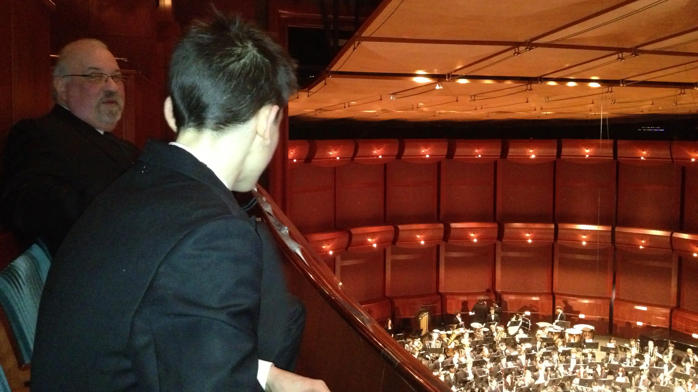
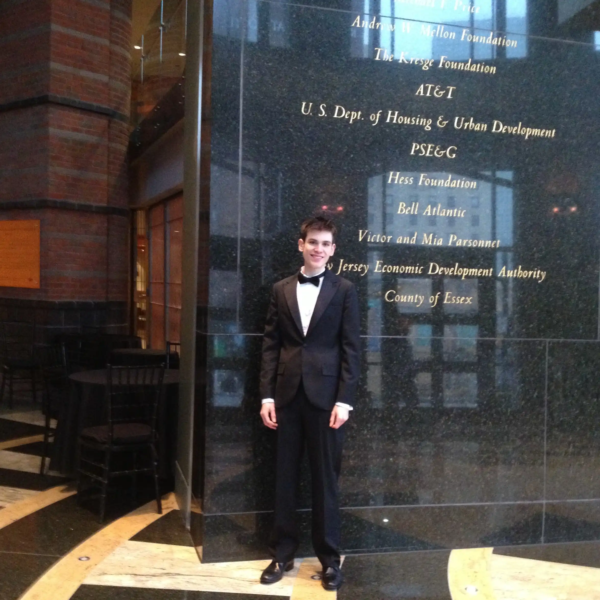
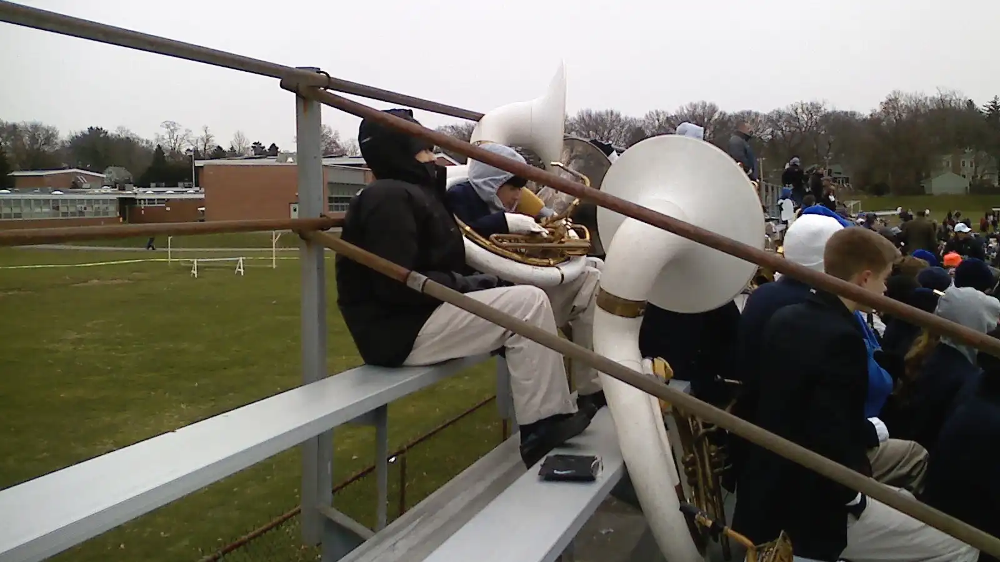
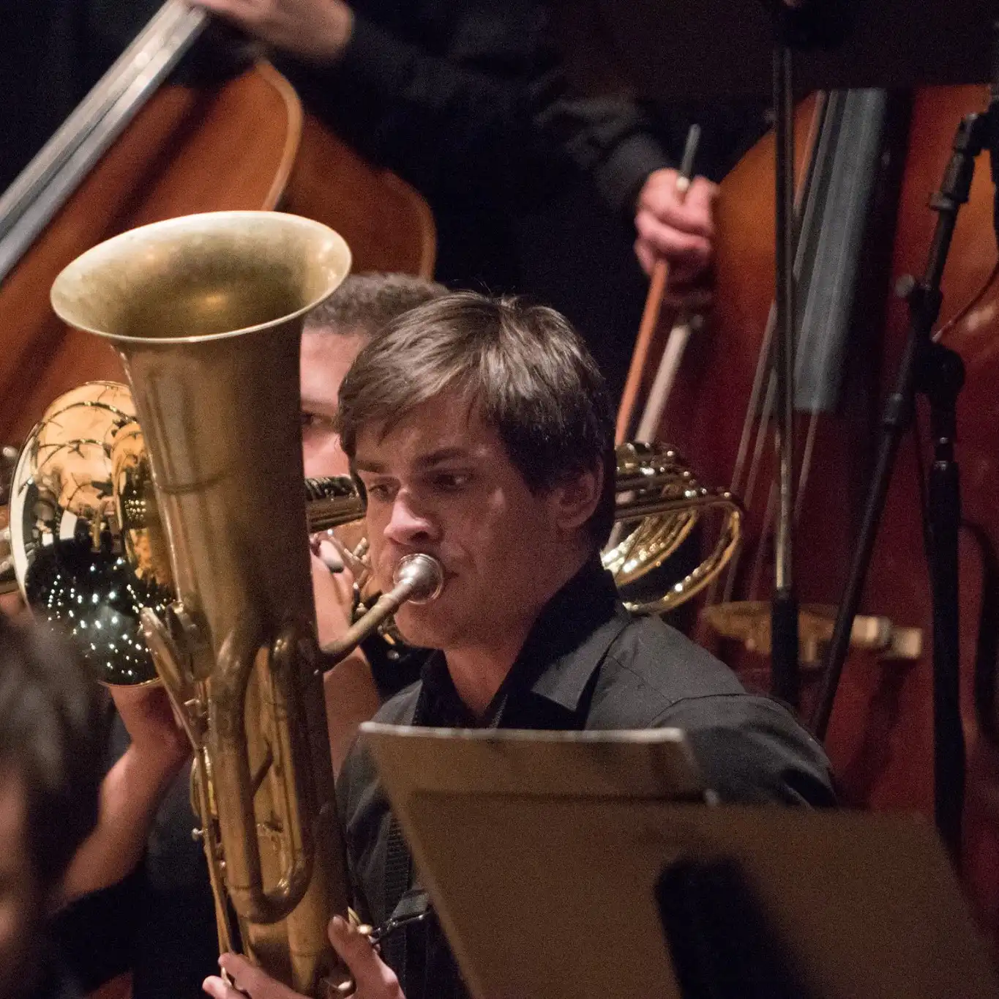
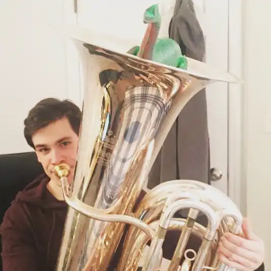

<!-- 
  You can also find my articles on <u><a class="cust" href="{{author.googlescholar}}">my Google Scholar profile</a>.</u>
 -->




  


------

<section class="jump-to">
  
Jump to:

  <ul>
    <li><a class="cust" href="#Bio">Bio and Background</a></li>
    <li><a class="cust" href="#photo-gallery">Gallery</a></li>
    <li><a class="cust" href="#recordings">Recordings</a></li>

  </ul>
</section>

<h2 id="Bio" class="larger-heading">Bio and Background</h2>
  

    

      

        I began practicing music seriously in the sixth grade after deciding to learn the tuba. I had started on trumpet but didn't enjoy it due to difficulties with embouchure. Developing tuba 'chops', for me at least, was more forgiving. As one might expect, the tuba parts in the pieces our sixth grade band was performing were not very exciting, and sheet music around 2007, let alone free sheet music, was not as ubiquitous as it is today. So I had to learn to transpose and transcribe pretty early on if I hoped to play any exciting rep.
      

      

        Our band director recommended I take private lessons and so I started studying with Joe Eggebeen. He must have heard something in my playing, as he quickly started encouraging me to audition for the regional band. I don't know how, but I placed first in the audition, and from then onward music became my priority. I discovered figures like Leonard Bernstein, who led me to discover the full scope of roles low brass can take on in an orchestra.
      

    

    

        <figure class="squared">
          
          <figcaption>following a UNCSO performance</figcaption>
        </figure>
    

    

  

    

        

        I continued taking auditions throughout high school, so while my classmates at MHS were busy competing over AP qualifiers, I was traveling for performances. I remember during my sophomore year of high school, a friend's mother told me that I needed to stop focusing on music, otherwise I wouldn't get into any colleges. When my senior year rolled around though, I was honored to reeceive a New Jersey Governor's Award in Arts Education, followed by the William R. Kenan Jr. Music Scholarship, a four year, full scholarship to the University of North Carolina at Chapel Hill.
        

        

          During my time at UNC, I studied under retired principal trombonist of the North Carolina Symphony, Michael Kris. I performed frequently with the Symphony Orchestra, Wind Ensemble, Brass Quintet, Tuba/Euph Quartet, Sackbut Ensemble, and trombone choir. I also played in a local brass band, and in festivals during the summers. Thanks to professor Kris, I was able to explore the world of historically informed performance, learning and performing on instruments such as the Sackbut and Ophicleide.
        

     

     

        <figure class="portrait">
          
          <figcaption>Giving my grandma a demo of the cimbasso</figcaption>
        </figure>
    

  

  

    

      

        I supplemented my studies by traveling and taking lessons with principal tubists of major orchestras up and down the east coast, and used the stipend included with my scholarship to study with principals throughout the UK and EU. Ultimately however, I chose to leave UNC before graduating due to persistent health issues and a combination of rather unforgiving imposter syndrome and constant ruminations about my future as a musician. I still practice and perform my own arrangements/transcriptions today. 
      

      

        Favorite composers include Mahler, Shostakovich, R. Strauss, Sibelius, G. Gabrieli, Tchaikovsky, Bruckner, Berlioz, Verdi as well as film composers like Ennio Morricone. I am currently teaching myself the harmonica & various <a class="noul" href="https://stonewhistle.com/">Stonewhistle</a> clay flutes for a larger tribute to Ennio Morricone I have been working on for about half a year.
      

    

    

      <figure class="rect">
        
        <figcaption>sitting in on a Mahler 8 rehearsal following a lesson in the Royal Albert Hall in London</figcaption>
      </figure>
    

  

  

    

      <ul class="fix">
        <li>B&S PT-6 Contrabass Tuba (C)</li>
        <li>Miraphone <em>Elektra</em> Bass Tuba (F)</li>
        <li>Dillon Cimbasso (F)</li>
        <li>Inexpensive no-name Bass Trombone</li>
        <li>Hohner <em>Special 20</em> in C, G, and A</li>
        <li>Stonewhistle <em>Natey</em> (G4)</li>
        <li>Stonewhistle <em>ZENFlute</em> (Large - E3)</li>
      </ul>
    

    

      <figure class="squared">
        
        <figcaption>Tight squeeze</figcaption>
      </figure>
    

  

<h2 class="larger-heading" id="photo-gallery">Gallery</h2>

Pre-UNC

<figure>

<figcaption></figcaption>
</figure>

<figure>

<figcaption></figcaption>
</figure>

<figure>

<figcaption></figcaption>
</figure>

<figure>

<figcaption></figcaption>
</figure>

<figure>

<figcaption></figcaption>
</figure>

<figure>

<figcaption></figcaption>
</figure>

<figure>

<figcaption></figcaption>
</figure>

<figure>

<figcaption></figcaption>
</figure>

<figure>

<figcaption></figcaption>
</figure>

<figure>

<figcaption></figcaption>
</figure>

<figure>

<figcaption></figcaption>
</figure>

<figure>

<figcaption></figcaption>
</figure>

<figure>

<figcaption></figcaption>
</figure>

<figure>

<figcaption></figcaption>
</figure>

<figure>

<figcaption></figcaption>
</figure>

<figure>

<figcaption></figcaption>
</figure>

<figure>

<figcaption></figcaption>
</figure>

<figure>

<figcaption></figcaption>
</figure>

  <figure>
  
  <figcaption></figcaption>
  </figure>

NMF 2016

<figure>

<figcaption></figcaption>
</figure>

<figure>

<figcaption></figcaption>
</figure>

<figure>

<figcaption></figcaption>
</figure>

<figure>

<figcaption></figcaption>
</figure>

<figure>

<figcaption></figcaption>
</figure>

<figure>

<figcaption></figcaption>
</figure>

<figure>

<figcaption></figcaption>
</figure>

<figure>

<figcaption></figcaption>
</figure>

<figure>

<figcaption></figcaption>
</figure>

<figure>

<figcaption></figcaption>
</figure>

<figure>

<figcaption></figcaption>
</figure>

<figure>

<figcaption></figcaption>
</figure>

  <figure>
  
  <figcaption></figcaption>
  </figure>

UNC

<figure>

<figcaption></figcaption>
</figure>

<figure>

<figcaption></figcaption>
</figure>

<figure>

<figcaption></figcaption>
</figure>

<figure>

<figcaption></figcaption>
</figure>

<figure>

<figcaption></figcaption>
</figure>

<figure>

<figcaption></figcaption>
</figure>

<figure>

<figcaption></figcaption>
</figure>

<figure>

<figcaption></figcaption>
</figure>

<figure>

<figcaption></figcaption>
</figure>

<figure>

<figcaption></figcaption>
</figure>

<figure>

<figcaption></figcaption>
</figure>

<figure>

<figcaption></figcaption>
</figure>

<figure>

<figcaption></figcaption>
</figure>

<figure>

<figcaption></figcaption>
</figure>

<figure>

<figcaption></figcaption>
</figure>

<figure>

<figcaption></figcaption>
</figure>

<figure>

<figcaption></figcaption>
</figure>

<figure>

<figcaption></figcaption>
</figure>

<figure>

<figcaption></figcaption>
</figure>

<figure>

<figcaption></figcaption>
</figure>

<figure>

<figcaption></figcaption>
</figure>

<figure>

<figcaption></figcaption>
</figure>

<figure>

<figcaption></figcaption>
</figure>

<figure>

<figcaption></figcaption>
</figure>

<figure>

<figcaption></figcaption>
</figure>

<figure>

<figcaption></figcaption>
</figure>

<figure>

<figcaption></figcaption>
</figure>

<figure>

<figcaption></figcaption>
</figure>

<figure>

<figcaption></figcaption>
</figure>

<figure>

<figcaption></figcaption>
</figure>

<figure>

<figcaption></figcaption>
</figure>

<figure>

<figcaption></figcaption>
</figure>

<figure>

<figcaption></figcaption>
</figure>

<figure>

<figcaption></figcaption>
</figure>

<figure>

<figcaption></figcaption>
</figure>

<figure>

<figcaption></figcaption>
</figure>

<figure>

<figcaption></figcaption>
</figure>

<figure>

<figcaption></figcaption>
</figure>

<figure>

<figcaption></figcaption>
</figure>

<figure>

<figcaption></figcaption>
</figure>

<figure>

<figcaption></figcaption>
</figure>

<figure>

<figcaption></figcaption>
</figure>

<!-- 
<figure>

<figcaption></figcaption>
</figure> -->

  <figure class="span-full">
    
  <figcaption></figcaption>
  </figure>

Misc Recordings

  Unfortunately, most of the recordings I have made over the years were lost after an older laptop died right before the onset of covid. Here's some of the recordings I was able to recover, albeit low quality ones as they were generally made with a very old iPhone camera/mic. Others are YouTube videos of live performances.

  <figure class="rect-large">
    <iframe class="rect-large" width="560" height="315" src="https://www.youtube.com/embed/9xN6CouzZ70?si=LLDh5VrVgvU_NiQa" title="YouTube video player" frameborder="0" allow="accelerometer; autoplay; clipboard-write; encrypted-media; gyroscope; picture-in-picture; web-share" allowfullscreen></iframe>
    <figcaption class="rect-large">Bruckner Symphony No. 4, <em>Romantische</em>. I'm torn on linking just the low brass highlights from the performance. The piece is monumental; lush, brooding, expansive. Words do no justice.</figcaption>
  </figure>

<figure class="rect-rec">
    <iframe class="rect-rec" width="560" height="315" src="https://www.youtube.com/embed/2_uWm7Qw8SE?si=794Q6Q5IWEoFf9-q" title="YouTube video player" frameborder="0" allow="accelerometer; autoplay; clipboard-write; encrypted-media; gyroscope; picture-in-picture; web-share" allowfullscreen></iframe>
    <figcaption class="rect-rec">Bruckner 8 in Ram's parking deck to give the folks at light night a show. I'm out of frame, but the this was of course on the contrabass (silver)</figcaption>
  </figure>
  
  <figure class="rect-rec">
    <iframe class="rect-rec" width="560" height="315" src="https://www.youtube.com/embed/2DOZoixFfyY?si=71czVarOlJyvMP-R" title="YouTube video player" frameborder="0" allow="accelerometer; autoplay; clipboard-write; encrypted-media; gyroscope; picture-in-picture; web-share" allowfullscreen></iframe>
    <figcaption class="rect-rec">Some early music. Title unknown. Youtube seems to think it's an original composition from a film, but the melody and bassline were pulled out of a pre-classical music history textbook</figcaption>
  </figure>

  <figure class="short">
    <iframe class="short" width="300" height="560" src="https://youtube.com/embed/EdqeiqruZrk?si=rkknyKxhfKXU4r6E" title="YouTube video player"
    frameborder="0" allow="accelerometer; autoplay; clipboard-write encrypted-media; gyroscope; picture-in-picture; web-share" allowfullscreen></iframe>
    <figcaption class="short">First rehearsal on my cimbasso. Was still very much getting the feel for it. Excuse the omitted notes</figcaption>
  </figure>

  <figure class="short">
    <iframe class="short" width="300" height="560" src="https://youtube.com/embed/jUn5pLqAroA?si=fv9frxi9aCKzU-v7" title="YouTube video player"
    frameborder="0" allow="accelerometer; autoplay; clipboard-write encrypted-media; gyroscope; picture-in-picture; web-share" allowfullscreen></iframe>
    <figcaption class="short">Rehearsal of my arrangement of Bo Burnham's <em>Goodbye</em>. The show including this track marked the end of a 5 year hiatus from performing - and worse, practicing at all. Chops were still regaining their strength.</figcaption>
  </figure>

  <figure class="rect-large">
    <iframe class="rect-large" width="560" height="315" src="https://www.youtube.com/embed/Wa08EktDEwc?si=nx8QPxeaCY_eWayN" title="YouTube video player" frameborder="0" allow="accelerometer; autoplay; clipboard-write; encrypted-media; gyroscope; picture-in-picture; web-share" allowfullscreen></iframe>
    <figcaption class="rect-large">"Danse bacchanale" from <em>Samson et Dalila</em> with UNCSO. Frenetic, sublime, explosive, as a bacchanale should be I suppose.</figcaption>
  </figure>

<figure class="rect-rec">
    <iframe class="rect-rec" width="560" height="315" src="https://www.youtube.com/embed/2E93Jvaykdo?si=Rtv86TVdc-WHAjPi" title="YouTube video player" frameborder="0" allow="accelerometer; autoplay; clipboard-write; encrypted-media; gyroscope; picture-in-picture; web-share" allowfullscreen></iframe>
    <figcaption class="rect-rec">Scherzo from Shostakovich 10 arranged for brass band. Was still getting used to Eb bass transposition, did a stand recording to check pitches. Half decent I'd wager. </figcaption>
  </figure>
  
  <figure class="rect-rec">
    <iframe class="rect-rec" width="560" height="315" src="https://www.youtube.com/embed/ovOGb0LrOOM?si=fDQfYPTE5rYjvDGP" title="YouTube video player" frameborder="0" allow="accelerometer; autoplay; clipboard-write; encrypted-media; gyroscope; picture-in-picture; web-share" allowfullscreen></iframe>
    <figcaption class="rect-rec">As Mr. DNA would say, <a class="noul" href="https://www.reddit.com/r/JurassicPark/comments/9166bh/thanks_to_the_original_movie_i_cant_say_dinosaur/?rdt=43163">Dino<em>sawr</em></a>. This was at ITEF 2018, Dr. Adam Frey conducting a 300 piece tuba/euph choir, with myself on Cimbasso.</figcaption>
  </figure>

  <figure class="rect-large">
    <iframe class="rect-large" width="560" height="315" src="https://www.youtube.com/embed/9hLF8JwjTCQ?si=S29KBUAiPRhD_pZj&amp;start=273" title="YouTube video player" frameborder="0" allow="accelerometer; autoplay; clipboard-write; encrypted-media; gyroscope; picture-in-picture; web-share" allowfullscreen></iframe>
    <figcaption class="rect-large">Verdi sans cimbasso. The whole overture is great, linked ~halfway through here.</figcaption>
  </figure>

  <figure class="rect-rec">
    <iframe class="rect-rec" width="560" height="315" src="https://www.youtube.com/embed/ORGNAatIIbY?si=fE-hC5KnzSYPzIJg" title="YouTube video player"
    frameborder="0" allow="accelerometer; autoplay; clipboard-write; encrypted-media; gyroscope; picture-in-picture; web-share" allowfullscreen></iframe>
    <figcaption class="rect-rec"><em>Symphonie Fantastique</em> rehearsal clip, on ophicleide (we called this oph the (awful)cleide because it was falling apart and nigh impossible to get in tune. I had about a month and a half to learn how to play it. I thought following NMF I would never play it again, but that thing kept haunting me).</figcaption>
  </figure>

  <figure class="rect-rec">
    <iframe class="rect-rec" width="560" height="315" src="https://www.youtube.com/embed/UjwaBo3YsWs?si=7WBEeRSiY502VXk8" title="YouTube video player" frameborder="0" allow="accelerometer; autoplay; clipboard-write; encrypted-media; gyroscope; picture-in-picture; web-share" allowfullscreen></iframe>
    <figcaption class="rect-rec">reconvening after summer break to aggressively blast excerpts at midnight is a bad habit, but it's fun</figcaption>
  </figure>

  <figure class="rect-large">
    <iframe class="rect-large" width="560" height="315" src="https://www.youtube.com/embed/eAbvQAYtOZg?si=TRTO2fRJbEispnee&amp;start=1274" title="YouTube video player" frameborder="0" allow="accelerometer; autoplay; clipboard-write; encrypted-media; gyroscope; picture-in-picture; web-share" allowfullscreen></iframe>
    <figcaption class="rect-large">Clip from the final phrases of Hindemith's <em>Nobilissima visione</em> with UNCSO. We had a saying for when the trombones and I let loose: <em>run the meat</em></figcaption>
  </figure>

  <figure class="short">
    <iframe class="short" width="300" height="560" src="https://youtube.com/embed/W3Q-wKn8yOc?si=xWnLrwBdXhOj2N2c" title="YouTube video player"
    frameborder="0" allow="accelerometer; autoplay; clipboard-write encrypted-media; gyroscope; picture-in-picture; web-share" allowfullscreen></iframe>
    <figcaption class="short">First rehearsal using the <em>Elektra</em>. Quintet had a yearly gig at the white-coating ceremony and Holst was always a fan-favorite (aka nobody paid attention to us)</figcaption>
  </figure>

  <figure class="short" >
    <iframe class="short" width="300" height="560" src="https://youtube.com/embed/OB-tpZYnxXs?si=p14SfIibSfnf554l" title="YouTube video player"
    frameborder="0" allow="accelerometer; autoplay; clipboard-write encrypted-media; gyroscope; picture-in-picture; web-share" allowfullscreen></iframe>
    <figcaption class="short"><em>Symphonie Fantastique</em> finale excerpt (not on ophicleide though thank gawd). I had realized there's an alternate fingering which makes the bursts of maniacal laughter easier and wanted to check the sound. Notes were missed, but I played more than was necessary to make check</figcaption>
  </figure>

  <figure class="rect-large">
    <iframe class="rect-large" width="560" height="315" src="https://www.youtube.com/embed/wKJTnt2PGNs?si=Mu4-pDqvC5R0kEFI&amp;start=451" title="YouTube video player" frameborder="0" allow="accelerometer; autoplay; clipboard-write; encrypted-media; gyroscope; picture-in-picture; web-share" allowfullscreen></iframe>
    <figcaption class="rect-large">Some Berlioz with UNCSO. Something something 'all music is love music, pirate music, or both'</figcaption>
  </figure>

  <figure class="short" >
    <iframe class="short" width="300" height="560" src="https://youtube.com/embed/tuK_QbsmjnA?si=E9qUSy6LD_zvoBqn" title="YouTube video player"
    frameborder="0" allow="accelerometer; autoplay; clipboard-write encrypted-media; gyroscope; picture-in-picture; web-share" allowfullscreen></iframe>
    <figcaption class="short">Goofin around. Simply a scale; I can't recall if the phrase is from Miklos Rozsa's film score to <em>The Thief of Bagdad</em> or one of the other pieces we did at NMF</figcaption>
  </figure>

  <figure class="short" >
    <iframe class="short" width="300" height="560" src="https://www.youtube.com/embed/pP1aE5UQ3bk" title="YouTube video player"
    frameborder="0" allow="accelerometer; autoplay; clipboard-write encrypted-media; gyroscope; picture-in-picture; web-share" allowfullscreen></iframe>
    <figcaption class="short">During that same white-coat rehearsal. My good pal Danny likes this folk tune.</figcaption>
  </figure>

  <figure class="rect-large">
    <iframe class="rect-large" width="560" height="315" src="https://www.youtube.com/embed/zvaSX1aJ6MU?si=vW6JBAmfqb3JpcEL" title="YouTube video player" frameborder="0" allow="accelerometer; autoplay; clipboard-write; encrypted-media; gyroscope; picture-in-picture; web-share" allowfullscreen></iframe>
    <figcaption class="rect-large">A wild ophicleide appeared - cover your ears. Nah at this point I was slightly better on oph, so maybe just partially cover (Oph is tacit for most of this so most would probably get bored and check out by the time the ophicleide (me) enters. Either they're startled awake by the atrocious sound, or bissfully unaware of the crimes against tonality propagating past them).</figcaption>
  </figure>

  <figure class="short" >
    <iframe class="short" width="300" height="560" src="https://youtube.com/embed/81sWr58K6Gc?si=nTANxBLwkUeN_BZ3" title="YouTube video player"
    frameborder="0" allow="accelerometer; autoplay; clipboard-write encrypted-media; gyroscope; picture-in-picture; web-share" allowfullscreen></iframe>
    <figcaption class="short">Attempting the triplet varation of Carnival of Venice on...cimbasso? Why not.</figcaption>
  </figure>

  <figure class="short" >
    <iframe class="short" width="300" height="560" src="https://youtube.com/embed/8y0B7OQHQUc?si=oAInmCGfRwQ-lH0J" title="YouTube video player"
    frameborder="0" allow="accelerometer; autoplay; clipboard-write encrypted-media; gyroscope; picture-in-picture; web-share" allowfullscreen></iframe>
    <figcaption class="short">Carnival of Venice triplet variation again, but on bass tuba. Only linked to demo the differences in sound, I forgot to turn the page, and got butterfingers to boot. You can tell by my vocalizations I wasn't pleased.</figcaption>
  </figure>

  <figure class="rect-large">
    <iframe class="rect-large" width="560" height="315" src="https://www.youtube.com/embed/6oOCbNENMYc?si=Q3dlqXnPotFUnIa2" title="YouTube video player" frameborder="0" allow="accelerometer; autoplay; clipboard-write; encrypted-media; gyroscope; picture-in-picture; web-share" allowfullscreen></iframe>
    <figcaption class="rect-large">Britten, as it's written. We actually did Britten's War Requiem the year before this, however the recording is not public.</figcaption>
  </figure>

  <figure class="rect-large">
    <iframe class="rect-large" width="560" height="315" src="https://www.youtube.com/embed/9TxqOCjhvHo?si=_Icg18sulZOgwmDr" title="YouTube video player" frameborder="0" allow="accelerometer; autoplay; clipboard-write; encrypted-media; gyroscope; picture-in-picture; web-share" allowfullscreen></iframe>
    <figcaption class="rect-large">Some Brahms for your evening listening.</figcaption>
  </figure>

